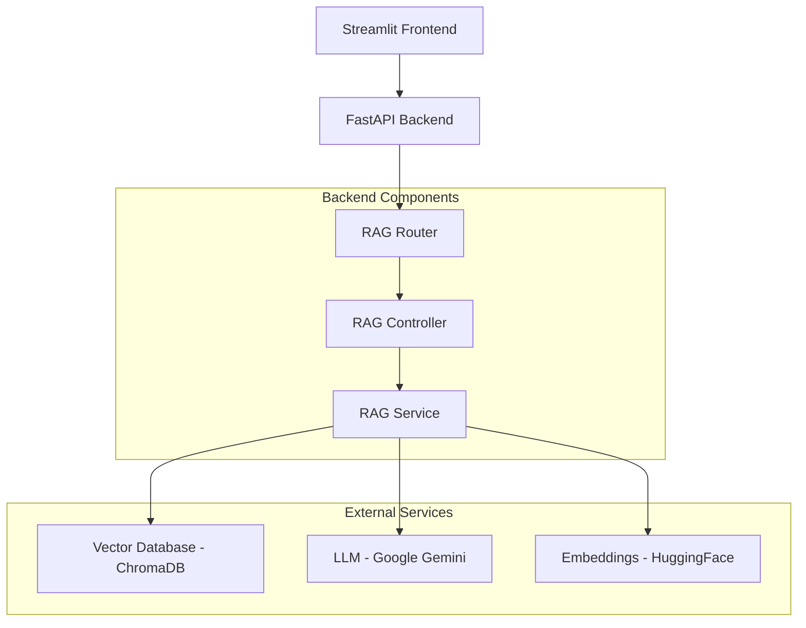
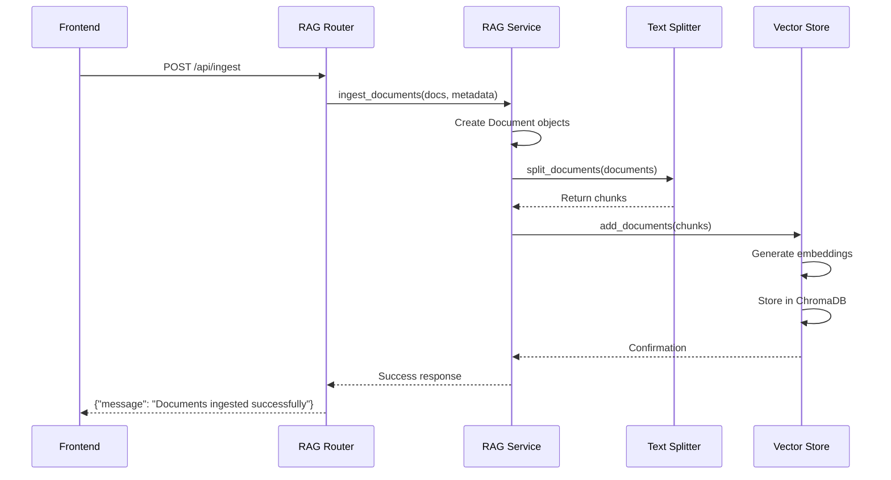
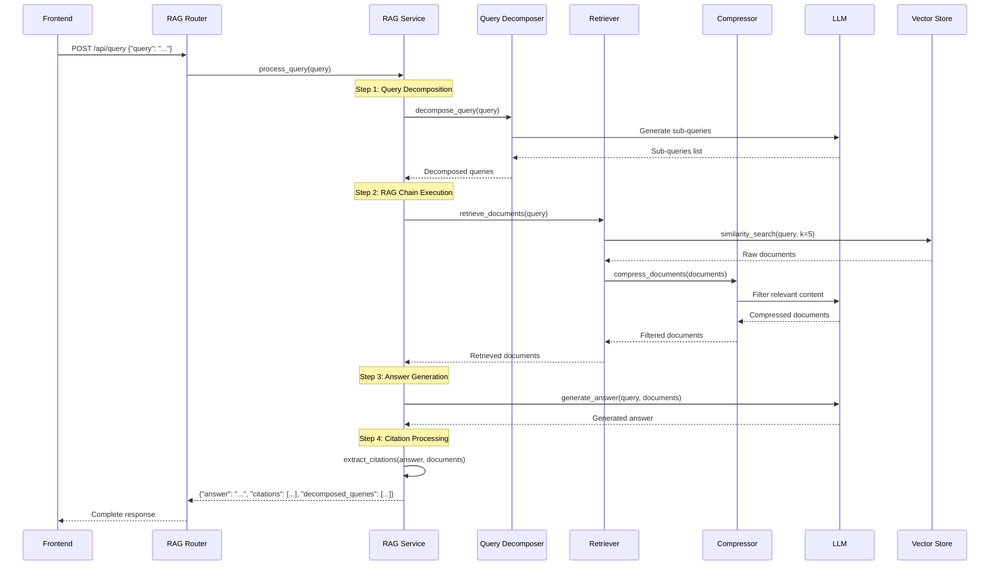
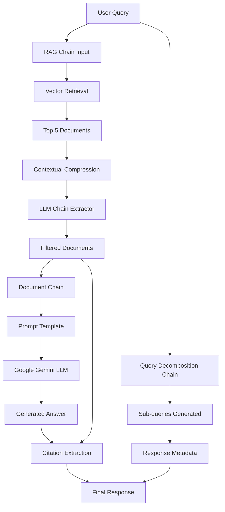

# Sports Analytics RAG System - Flow Documentation

## Overview
This document describes the complete flow of the Sports Analytics RAG System, detailing what happens behind the scenes when each API endpoint is called, including the function calls and data flow.

## System Architecture Flow

### 1. Application Initialization

**Backend Startup Flow:**
```
main.py → FastAPI App Creation → Router Registration → CORS Middleware Setup
```

**Components Initialized:**
- FastAPI application with title and description
- CORS middleware for cross-origin requests
- RAG router registration under `/api` prefix
- RAGService singleton instance creation

---

## API Endpoint Flows

### 1. Root Endpoint: `GET /`

**Flow:**
```
User Request → FastAPI Router → main.py:read_root() → JSON Response
```

**Function Chain:**
- `main.py:read_root()` → Returns welcome message

**Response:**
```json
{
  "message": "Welcome to the Sports Analytics API"
}
```

---

### 2. Document Ingestion: `POST /api/ingest`

**Complete Flow:**
```
Frontend Button Click → HTTP POST Request → FastAPI Router → RAG Controller → Vector Database
```

**Detailed Function Chain:**
```
frontend/app.py:requests.post() 
→ routers/rag_router.py:ingest_documents_endpoint()
→ controller/rag_controller.py:RAGService.ingest_documents()
→ Document Processing Pipeline
```

**Backend Processing Steps:**

1. **Route Handler** (`rag_router.py:ingest_documents_endpoint()`)
   - Creates sample documents array
   - Creates metadata array
   - Calls RAGService.ingest_documents()

2. **Document Processing** (`rag_controller.py:ingest_documents()`)
   ```
   Sample Data Creation → Document Objects → Text Splitting → Embedding → Vector Storage
   ```

3. **Detailed Processing Chain:**
   - Create Document objects with content and metadata
   - `RecursiveCharacterTextSplitter(chunk_size=1000, chunk_overlap=100)`
   - `text_splitter.split_documents(documents)`
   - `vector_store.add_documents(chunks)`
   - `vector_store.persist()`

**Sample Documents Ingested:**
- Team A defense statistics (source: report_A)
- Team B defense statistics (source: report_B)  
- Messi goal statistics (source: player_stats_messi)
- Goalkeeper statistics (source: goalkeeper_report_2023)

---

### 3. Query Processing: `POST /api/query`

**Complete Flow:**
```
Frontend Query → HTTP POST → FastAPI Router → RAG Controller → Query Processing Pipeline → Response
```

**Detailed Function Chain:**
```
frontend/app.py:requests.post()
→ routers/rag_router.py:query_rag_system()
→ controller/rag_controller.py:RAGService.process_query()
→ Multi-step RAG Pipeline
```

**Backend Processing Pipeline:**

#### Step 1: Route Handler (`rag_router.py:query_rag_system()`)
```
Request Validation → Extract Query → Call RAGService → Return Response
```

#### Step 2: Query Processing (`rag_controller.py:process_query()`)

**2.1 Query Decomposition:**
```
Original Query → LLM Chain → Decomposed Sub-queries
```
- `_get_query_decomposition_chain()`
- `ChatPromptTemplate` with system prompt for query breakdown
- `query_decomposition_prompt | llm | StrOutputParser()`
- Returns comma-separated sub-queries

**2.2 RAG Chain Execution:**
```
Query → Retrieval → Compression → Answer Generation
```

**Detailed RAG Chain Flow:**
```
Input Query
→ create_retrieval_chain(retriever, document_chain)
→ Retriever (with compression)
→ Document Retrieval
→ Contextual Compression
→ Answer Generation
→ Citation Extraction
```

**2.3 Retrieval Process:**
- **Base Retriever**: `vector_store.as_retriever(search_kwargs={"k":5})`
- **Contextual Compression**: `LLMChainExtractor.from_llm(llm)`
- **Compression Retriever**: `ContextualCompressionRetriever`

**2.4 Answer Generation:**
- **Prompt Template**: System prompt with context and question placeholders
- **Document Chain**: `create_stuff_documents_chain(llm, qa_prompt)`
- **Full Chain**: `create_retrieval_chain(retriever, document_chain)`

**2.5 Citation Processing:**
- Extract retrieved documents from result
- Check if source citations appear in answer
- Create citation objects with source and text snippets

---

## Mermaid Diagrams

### System Architecture Overview



### Document Ingestion Flow



### Query Processing Flow



### RAG Chain Internal Flow



---

## Function Call Hierarchy

### Ingestion Endpoint
```
rag_router.py:ingest_documents_endpoint()
├── Create sample documents and metadata
└── rag_controller.py:RAGService.ingest_documents()
    ├── Create Document objects
    ├── RecursiveCharacterTextSplitter.split_documents()
    ├── vector_store.add_documents()
    └── vector_store.persist()
```

### Query Endpoint
```
rag_router.py:query_rag_system()
├── Request validation
└── rag_controller.py:RAGService.process_query()
    ├── _get_query_decomposition_chain()
    │   ├── ChatPromptTemplate.from_messages()
    │   ├── llm (Google Gemini)
    │   └── StrOutputParser()
    ├── qa_chain.invoke()
    │   ├── create_retrieval_chain()
    │   │   ├── retriever (ContextualCompressionRetriever)
    │   │   │   ├── LLMChainExtractor.from_llm()
    │   │   │   └── vector_store.as_retriever()
    │   │   └── document_chain
    │   │       ├── create_stuff_documents_chain()
    │   │       ├── ChatPromptTemplate.from_messages()
    │   │       └── llm (Google Gemini)
    │   └── Return {"answer": "...", "context": [...]}
    └── Citation processing
        ├── Extract source metadata
        ├── Check citation usage in answer
        └── Create citation objects
```

---

## Data Flow Summary

### Input Data Flow
1. **User Query** → Frontend text input
2. **HTTP Request** → JSON payload with query
3. **FastAPI Route** → Request validation
4. **RAG Service** → Query processing pipeline

### Processing Data Flow
1. **Query Decomposition** → Break into sub-queries
2. **Vector Retrieval** → Similarity search in ChromaDB
3. **Contextual Compression** → LLM-based filtering
4. **Answer Generation** → Gemini LLM with retrieved context
5. **Citation Extraction** → Source tracking and snippet creation

### Output Data Flow
1. **Structured Response** → Answer, citations, decomposed queries
2. **JSON Serialization** → Pydantic model validation
3. **HTTP Response** → Return to frontend
4. **UI Display** → Formatted presentation to user

---

## Error Handling Flow

### Common Error Scenarios
1. **Missing API Key** → Environment variable check in controller initialization
2. **Database Connection** → ChromaDB persistence directory validation
3. **LLM API Errors** → Google Gemini API rate limiting/errors
4. **Embedding Errors** → HuggingFace model loading issues
5. **Frontend Connection** → CORS and network connectivity

### Error Propagation
```
Error Source → RAG Service → RAG Router → FastAPI Error Handler → Frontend Display
``` 